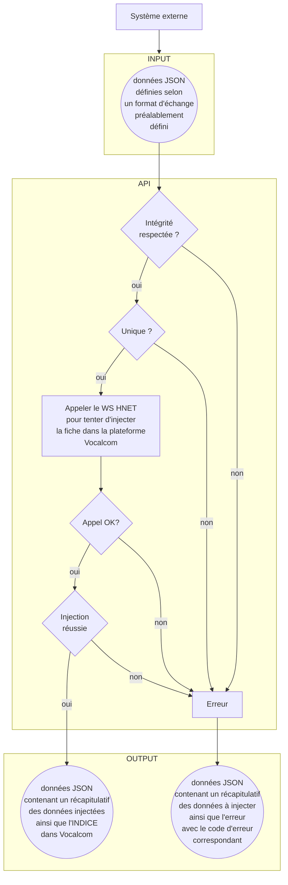

# Mise en place des Web Services pour Centre de contact
## Préalable
### Création d'un nouveau projet
Modèle: application web ASP.NET (.NET Framework)
Configurer votre nouveau projet
Donner un nom et ajuster la version du Framework .NET en fonction de la configuration du serveur de prod.
Cliquer sur Créer
Lors de la phase de création d'un application, sélectionner Api web car on va créer un WS REST et cliquer sur Créer
### Ajouter la référence au WSDL de VOCALCOM
Faire un clic droit sur le projet dans l'explorateur des solutions, pointer sur Ajouter puis cliquer sur Référence de service...
Cliquer sur Avancé... dans la boîte de dialogue Ajouter une référence de service
Dans la boîte de dialogue Paramètres de référence de service, cliquer sur ajouter une référence web...
Dans la boîte de dialogue Ajouter une référence web, dans le champ URL, mettre le lien https://cloud2-vcl.vivetic.com/hermes_net_v5/admin/DataManager/Web_Service/CallFileUtilities.asmx et cliquer sur la flèche à droite.
Une fois chargé, donner un nom à la référence dans la zone Nom de la référence web (exemple VocalcomUtilities) et cliquer sur Ajouter une référence.
Vérifier que la référence est bien ajoutée
Cliquer sur le fichier Web.config et rechercher le bloc suivant vers la fin du fichier

    <applicationSettings>
	    <SAMPLE.Properties.Settings>
		    <setting name="SAMPLE_VocalcomUtilities_CallFileUtilities" serializeAs="String">
			    <value>https://cloud2-vcl.vivetic.com/hermes_net_v5/admin/DataManager/Web_Service/CallFileUtilities.asmx</value>
		    </setting>
	    </SAMPLE.Properties.Settings>
    </applicationSettings>
### Le package NLog
Ce package permet de tracer les logs de tous les événements ou seulement ceux filtrés dans des fichiers de log. 
#### Ajout
Cliquer sur le menu Projet puis cliquer sur Gérer les packages NuGet...
Dans l'onglet Parcourir, rechercher NLog. Il faut que les packages suivants soient installés:
- NLog
- NLog.Schema
- et NLog.Config

Cliquer sur NLog et dans le volet de droit, et cliquer sur le bouton Installer.
Attendez que l'installation se termine.

Cliquer ensuite sur NLog.Schema et cliquer sur le bouton Installer dans le volet droit.
Une fois l'installation terminée, répéter les mêmes opérations pour installer NLog.Config.
#### Configuration de NLog
Ce dont on aura besoin c'est de définir 
- où se trouvera le fichier log
- quel sera son contenu
- et quels niveaux de log

D'autres configurations sont possibles et pour cela, veuillez consulter [ce lien](https://github.com/nlog/NLog/wiki/Configuration-file).
Pour effectuer la configuration minimaliste, cliquer sur le fichier NLog.config dans l'explorateur de solutions et dans l'éditeur dans le volet gauche, dans la section `targets`, taper ceci:

    <target 
	    xsi:type="File" 
	    name="nom_de_target" 
	    fileName="${basedir}/logs/${shortdate}.log" 
	    layout="${longdate} ${uppercase:${level}} ${message}" 
    />
Où
- `name`: mettre un nom unique sans espace
- `fileName`: détermine l'emplacement et le nom du fichier log. 
	- dans la configuration ci-dessus, le fichier de log va se trouver dans un dossier logs contenu dans le même dossier que l'application.
	- le nom du fichier est horodaté dans le genre 2022-06-14 avec l'extension .log
- `layout`: détermine le modèle de contenu du fichier log. Dans la configuration ci-dessus, 
	- la variable `${longdate}` donnera 2022-05-31 12:52:50.4185
	- si le niveau du log est info, `${uppercase:${level}}` donnera INFO
	- et `${message}` donnera Tentative pour tâche 208... par exemple.

Dans la section `rules`, définir le niveau de log qui sera consigné dans le fichier.

    <logger 
	    name="*" 
	    minlevel="Info" 
	    writeTo="nom_de_target" 
    />

Où
- `name`: définit le nom du logger à appliquer. Mettre `*` comme valeur afin de l'appliquer sur tous les loggers.
- `minlevel`: est le niveau de log minimal à consigner. On en dénombre 6 niveaux. Les voici dans l'ordre croissant :
	- `Trace` (très verbeux)
	- `Debug` (utilisé à des fins de déboguage)
	- `Info` (pour les logs informatifs ou manuels)
	- `Warn` (pour les notices importantes par le système)
	- `Error` (pour les erreurs)
	- `Fatal` (pour les erreurs fatales)
Si on met `Info` par exemple, les niveaux `Fatal`, `Error`, `Warn` et `Info` seront consignés.
- `writeTo`: définit le `target` correspondant. Si on met `nom_de_target` par exemple, ces logs vont aller dans le fichier dont le nom du `target` est `nom_de_target`.

## Création du Web Service
Le Web Service recevra des données en input en format JSON, effectuera des vérifications (test d'intégrité des données) selon les règles métiers à prendre en compte et va tenter d'insérer ces données dans des tables d'appel et de client dans Vocalcom via le Web Service propre à HNET. Quelque soit le résultat du traitement, que les données soient bien insérées ou pas, le Web Service doit faire un retour en format JSON.

### Mettre en place les modèles
On aurait besoin de deux ou trois modèles:
- un pour le format d'échange entre le système externe et l'API en input;
- un pour le retour venant de l'API en output;
- et éventuellement un pour les erreurs.

#### Création d'un modèle

 - Faire un clic droit sur le dossier **Models** 
 - Dans le menu contextuel, pointer sur **Ajouter**, puis cliquer sur **Classe...**
 - Dans la boite de dialogue donner un nom à la nouvelle classe en gardant l'extension `.cs`. Exemple `Lead.cs`.

Vous devez obtenir un code comme présenté ci-après:

    using System;
    using System.Collections.Generic;
    using System.Linq;
    using System.Web;
    
    namespace SAMPLE.Models
    {
        public class Lead
        {
        }
    }
Dans la classe, ajouter les attributs nécessaires et les méthodes éventuellement utiles.

Pour ajouter un attribut, taper:

    public <type> <nom de champ> { get; set; }

Exemple:

    public string champ1 { get; set; }

> **Recommandation**: comme on ne maîtrise pas les données en input, préférer le type `string` à d'autres types et faire la vérification d'intégrité dans le système. Cela évite de gérer de gros soucis inutilement.

Pour ajouter une méthode, faire:

    public <type de retour> <nom de la méthode>(<type paramètre 1> <nom paramètre>, ...)
    {
    	...
    }

Exemples:

    public string DefineCle(Leads DataLead)
    {
    	string cle = DataLead.email;
    	return EncryptString(cle);
    }
    
    //Cette méthode retourne rien
    private static void Email(string body)
    {
    	logger.Info("Email ...");
    	try
    	{
    		...
    	}
    	catch (Exception)
    	{
    		logger.Error("Envoi échoué.");
    	}
    }

#### Créer le modèle chargé du format d'échange en input
##### Les attributs
En plus des champs nécessaires pour la fiche client, il faut **absolument** que parmi les champs en input, on ait trois champs en plus:

    //date système lors de l'appel de l'API - ce champ n'est pas à renseigner en input
    public string dateCreation { get; set; }
    //clé unique générée automatiquement lors de l'appel de l'API - ce champ n'est pas à renseigner en input
    public string cle { get; set; }
    //le numéro de téléphone - à renseigner en input car nécessaire pour Vocalcom
    public string telephone { get; set; }

Ci-après un exemple d'attributs tiré du projet **LP Promotion - Hubspot**.

    public string dateCreation { get; set; }
    public string cle { get; set; }
    public string civilite { get; set; }
    public string email { get; set; }
    public string nom { get; set; }
    public string prenom { get; set; }
    public string telephone { get; set; }
    public string codePostal { get; set; }
    public string adresse { get; set; }
    public string complementAdresse { get; set; }
    public string ville { get; set; }
    public string commentConnu { get; set; }
    public string informationSource1 { get; set; }
    public string conversionRecente { get; set; }
    public string message { get; set; }
    public string hubspotId { get; set; }
    public string optin { get; set; }
    public string proprietaireContact { get; set; }
##### Les méthodes
On doit ensuite définir plusieurs méthodes, au moins trois. Les trois premières parmi les méthodes suivantes sont obligatoires.
###### getClientFields()
Cette méthode qui est obligatoire, permet de définir les champs nécessaires pour la table des clients dans Vocalcom. Elle retourne un tableau de `string`.

    public string[] getClientFileds()
    {
    	string[] clientFields;
    	clientFields = new string[] { "dateCreation", "cle", "telephone", "autre champ", ... };
    	return clientFields;
    }
###### getClientPhone()
Encore une méthode obligatoire qui définit le(s) champ(s) utilisé(s) comme téléphone. Elle retourne aussi un tableau de `string`.

    public string[] getClientPhone()
    {
    	string[] clientPhone;
    	clientPhone = new string[] { "telephone" , "autre champ téléphone", ...};
    	return clientPhone;
    }

###### getData()
Cette méthode permet de retourner une collection d'objets de l'ensemble des champs envoyés en input. C'est une méthode obligatoire.

    public List<object[]> getData()
    {
	    //Initialisation de la collection de retour
	    List<object[]> data = new List<object[]>();
		
		//Renseigner la date système
		this.dateCreation = DateTime.Now.ToString("yyyy-MM-dd HH:mm:ss");
		//Définir la clé unique de la transaction
		this.cle = this.DefineCle(this);
		
		//Ajouter les autres codes pour normaliser les données
		//...

		//Créer la collection
		//lister tous les attributs définis au préalablement
		data.Add(new object[] {this.dateCreation, this.cle, this.telephone, ...});

		return data;
    }
###### Les autres méthodes
Deux autres méthodes peuvent être nécessaires car elles sont utilisées pour définir la clé de la transaction.

**DefineCle()**

Cette méthode permet de construire la clé en cryptant les valeurs de champs qui la constituent. Elle prend comme attribut le présent objet et retourne la clé sous format `string`. Dans l'exemple ci-après, la clé est constitué par l'adresse email uniquement.

    public string DefineCle(Lead DataLead)
    {
	    string cle = DataLead.email;
	    //renvoit la clé cryptée
	    return EncryptString(cle);
    }

**EncryptString()**

Cette méthode permet de crypter une chaîne de caractères. Elle prend en paramètre la chaîne de caractères et retourne un `string`.

    public static string EncryptString(string cle)
    {
	    //Définir le hash
	    string secret = "";
	    Encoding ascii = Encoding.ASCII;
	    HMACSHA256 hmac = new HMACSHA256(ascii.GetBytes(secret));
	    return Convert.ToBase64String(hmac.ComputeHash(ascii.GetBytes(cle)));
    }

#### Créer le modèle chargé de gérer les erreurs
##### Les attributs
Deux attributs sont à mettre en place: celui qui reçoit le code d'erreur et celui qui reçoit le message d'erreur.

    public int errCode { get; set; }
    public string errMessage { get; set; }
##### Les méthodes
Une méthode publique qui ne retourne pas de valeur mais destinée à lancer la vérification d'intégrité des données. Cette méthode doit avoir le même nom que la classe et elle appelle une méthode privée qui effectue les vérifications.

    public <nom de la classe>(Lead DataInject)
    {
	    //lance la vérification d'intégrité sur les données
	    this.checkIntegrity(DataInject);
    }

    private <type nom de la classe> checkIntegrity(Lead DataInject)
    {
	    try
	    {
		    //effectuer ici les vérifications nécessaires...
		    if (string.IsNullOrEmpty(DataInject.civilite.Trim()))
	        {
	            errCode = 40;
	            errMessage = "Le champ 'civilite' doit être renseigné.";
	            return this;
	        }
	        //...
	    }
	    catch (NullReferenceException e)
	    {
		    this.errCode = <code erreur>;
		    this.errMessage = "<message d'erreur>";
		    return this;
	    }
	    catch (Exception e)
	    {
		    this.errCode = <code erreur>;
		    this.errMessage = "<message d'erreur>";
		    return this;
	    }
    }
Prendre le temps de bien lister les erreurs possibles avec des codes d'erreurs différents et des messages explicites.
#### Créer le modèle chargé du format d'échange output
Ce modèle *ne devrait pas comporter de méthode*.
##### Les attributs
Les attributs obligatoires attendus sont:

    public string dateCreation { get; set; }
    public string cle { get; set; }
    public string callCenterProjectId { get; set; }
    public LeadsError error { get; set; }
Ci-après un exemple de la classe:

    public class LeadsReply
    {
        public string dateCreation { get; set; }
        public string cle { get; set; }
        public string civilite { get; set; }
        public string email { get; set; }
        public string nom { get; set; }
        public string prenom { get; set; }
        public string telephone { get; set; }
        public string codePostal { get; set; }
        public string adresse { get; set; }
        public string complementAdresse { get; set; }
        public string ville { get; set; }
        public string commentConnu { get; set; }
        public string informationSource1 { get; set; }
        public string conversionRecente { get; set; }
        public string message { get; set; }
        public string hubspotId { get; set; }
        public string optin { get; set; }
        public string proprietaireContact { get; set; }
        public string callCenterProjectId { get; set; }
        public LeadsError error { get; set; }
    }

